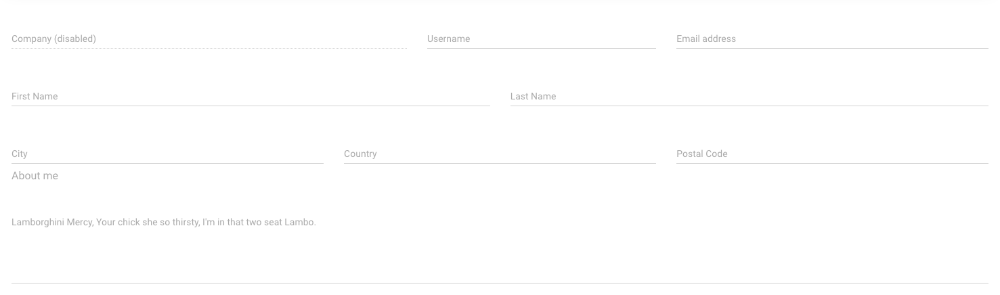

# Colman Dev Club Recruitment Day Challenge

  In this challenge you will have to add a secure sign in/up [JWT](https://jwt.io/) based functionality to the prebuilt dashboard.

## Run Locally
  
  - Clone this project.
  - In one terminal process run `cd backend; npm i; npm start`.
  - In another terminal process run `cd frontend; npm i; npm start`

## What you get
  
### Back

  - Pre-built NodeJs project, consumes with an express server and example route.

### Front

  - one of [creative team](https://www.creative-tim.com/) dashboard templates.

## What you need to do

### Back

  - Extend the users api so it can support these basic operations:
    - sign-in endpoint which generates a [JWT](https://jwt.io/) with the user credentials and send it to the user.
    - sign-up endpoint
    - sign-out endpoint
    - edit user endpoint which will be only accessible with the relevant user’s JWT.
  - **Important note** you are not required to manage a DB, added or delete data can be refreshed in each server run.
  - 🚀 **BONUS** 🚀  passwords in the db should be encrypted (you are not require to invent a special encryption and hash encryption you will find online will be enough for this bonus).
  

### Front

  - Add a decent looking login page with username and password, based on the existing
    template. On sign in you are able to save the JWT coming from the server in any way you would like.
  - Add a decent looking registration page with username and password, based on the
    existing template, with the following fields:
    
  - Add a logout feature which clears the user’s session (and delete the use JWT)
  - Integrate the existing “User Profile” component with your logged in user’s state,
    enabling the option to edit the user details

## Your Score

Your challenge score will be calculated on each of these subjects: 

  - Your ability to study a given subjects and apply what you learned.
  - Your ability to work in a group **IMPORTANT**.
  - Your ability to search online and find solutions in realtime.
  - 🚀 **TEAM BONUS** 🚀 -> work with git and github.
